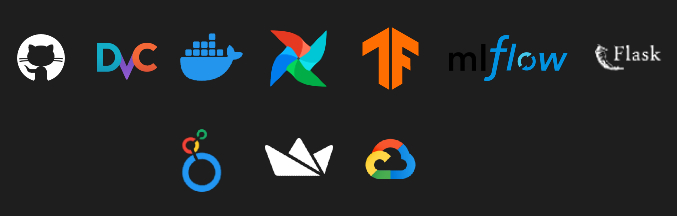
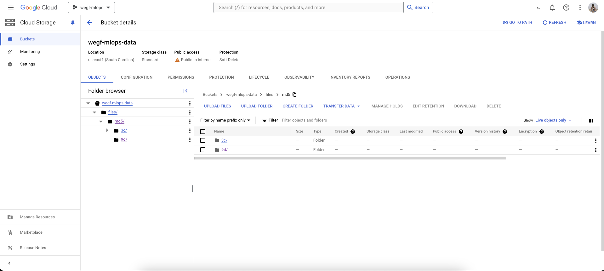
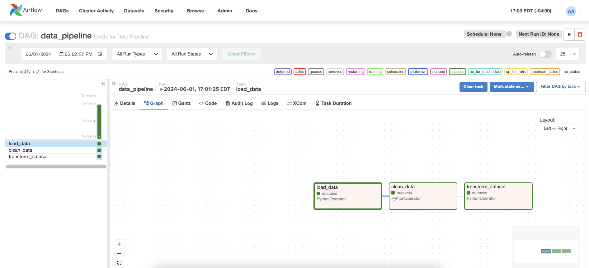

# World Econnomic Growth Forecast

The International Monetary Fund (IMF), since its inception, has played a pivotal role in stabilizing the international landscape of finance and economics. Its comprehensive databases and analytical prowess have been instrumental in aiding member countries to navigate through economic fluctuations and policy-making processes. In the contemporary globalized economy, the IMF's insights are more valuable than ever, providing a wealth of information that can be leveraged to predict future economic trends and potential market shifts.

Building on this foundation, our project aims to harness the vast repository of financial data curated by the IMF to develop robust models for forecasting Gross Domestic Product (GDP) growth across various economies. By employing advanced machine learning techniques and deep learning algorithms, we intend to analyze patterns within the data that could indicate future economic outcomes. This predictive model could serve as a crucial tool for economists, policymakers, and investors alike, offering a glimpse into the economic trajectory of nations in the ever-evolving financial landscape.

## Data Source

### World Economic Outlook 2024 Database
The dataset was obtained from the International Monetary Fund’s website (IMF). The WEO database contains a vast amount of data on various selected macroeconomic indicators for individual countries, regions, and the world as a whole, including national accounts, inflation, unemployment rates, balance of payments, and fiscal indicators.

Source : [Access the dataset here](https://www.imf.org/en/Publications/SPROLLS/world-economic-outlook-databases#sort=%40imfdate%20descending)

### Data Card
- **Size**: 58 columns, 8624 rows
- **File Format**: *.xls
- **Data Format**: Grouped by Subject then Country

### Variables

| Variable Name                | Role      | Type       | Description                                   |
|------------------------------|-----------|------------|-----------------------------------------------|
| WEO Country Code             | ID        | Integer    | Unique code for each country                  |
| WEO Subject Code             | ID        | String     | Code for GDP Parameters                       |
| Country                      | Feature   | String     | Countries of the world (196)                  |
| Subject Descriptor           | Feature   | Categorical| Various Factors affecting GDP                 |
| Units                        | ID        | String     | Unit of GDP Factors                           |
| Scale                        | ID        | String     | Scale of units                                |
| Country/Series-specific notes| ID        | String     | Information about source                      |
| Years (multiple columns)     | Feature   | Continuous | Years considered (1980-2029)                  |
| Estimate Start After         | Feature   | Integer    | Year till which data is collected             |

## Setup Instructions

### Prerequisites

Ensure you have the following installed on your system:

- Docker
- Python > 3.8
- Google Cloud Platform

### Step-by-Step Setup

1. **Clone the Repository**
```bash
git clone https://github.com/namansnghl/World-Econ-Growth-Forecast
cd <repository-directory>
```

2. **Check pyhton version**
```bash
python --version
```

3. **Install Python Dependencies**
```bash
pip install -r requirements.txt
```

4. **Install airflow**
```bash
pip install "apache-airflow[celery]==2.9.1" --constraint "https://raw.githubusercontent.com/apache/airflow/constraints-2.9.1/constraints-3.8.txt"
```
Make sure to change the python version above - "constraints-3.x"

5. **Check if you have enough memory to run docker (recommended 4GB)**
```bash
docker run --rm "debian:bullseye-slim" bash -c 'numfmt --to iec $(echo $(($(getconf _PHYS_PAGES) * $(getconf PAGE_SIZE))))'
```

6. **Initialize docker-compose.yaml**
```bash
curl -LfO 'https://airflow.apache.org/docs/apache-airflow/2.9.1/docker-compose.yaml'
```

7. **Initialize the database (only first time)**
```bash
docker compose up airflow-init
```

8. **Run Airflow with Docker**
```bash
docker compose up
```

9.  **Visit localhost:8080 login with credentials**
```bash
user:airflow
password:airflow
```

10. **Run the DAG by clicking on the play button on the right side of the window**<br/>
Ignore the example DAGS by setting load examples as false in docker-compose.yaml
```bash
AIRFLOW__CORE__LOAD_EXAMPLES: 'false'
```

11. **DVC Setup**
```bash
pip install dvc
```

12. **Initialize DVC**
```bash
dvc init
```

13. **Add files to DVC**
```bash
dvc add <file-path>
```

## Tools Used for MLOps
- GitHub
- Jupyter Notebook
- Docker
- Airflow
- DVC
- MLflow
- TensorFlow
- Flask
- Streamlit
- Google Cloud Platform (GCP)

     

1. **GitHub**: GitHub hosts the project's source code, documentation, and manages issues and pull requests. It has 3 branches `main`, `test-stage` and  `dev`. `pytest` is configured with GitActions. It builds and tests on every push.

2. **Jupyter Notebook**:  We have used it to experiment with different data cleaning and feature engineering techniques, as well as to visualize initial model results.

3. **DVC (Data Version Control)**: For managing datasets and machine learning models versioning, ensuring reproducibility and efficient data handling. DVC allows us to track data and model versions, making it easy to reproduce results and collaborate on data-intensive tasks without version conflicts. It is configured with `GCP`

    

4. **PyTest**: For writing and running unit tests to ensure code quality and functionality of individual components.

5. **GitHub Actions**: To automate workflows for continuous integration and continuous deployment (CI/CD), including running tests, building Docker images, and deploying models.

6. **Docker**: Containerizes applications and their dependencies, ensuring consistency across different environments and simplifying deployment.

7. **Airflow**: It manages the entire data pipeline, scheduling and monitoring tasks to ensure timely and reliable execution of the data processing and model training workflows.


    


8. **TensorFlow**: It provides a comprehensive ecosystem for developing, training, and deploying machine learning models. TensorFlow is used to build and train the predictive models in this project, leveraging its powerful APIs and tools to handle complex data and modeling tasks.

9. **MLFlow**: Managing the machine learning lifecycle, including experimentation, reproducibility, and model deployment, along with tracking metrics and parameters. 

10. **FastAPI/Flask**: It serves as the web framework for building RESTful APIs to use the machine learning models as services for integration with other applications. 

11. **Logging**: Implements logging mechanisms to track the performance, errors, and usage of the deployed models. Logging provides insights into the model's behavior and performance in production, helping to identify and troubleshoot issues quickly.

12. **Looker**: Utilized for business intelligence and data visualization to create interactive dashboards and reports that provide insights into model performance and business impact. 

13. **Streamlit**: Creates interactive web applications for visualizing data, model predictions, and performance metrics, facilitating easier engagement. 

14. **Google Cloud Platform**: Provides scalable cloud infrastructure for hosting, managing, and deploying machine learning models and applications. GCP offers the necessary infrastructure to deploy models at scale, ensuring high availability and performance for the deployed services.